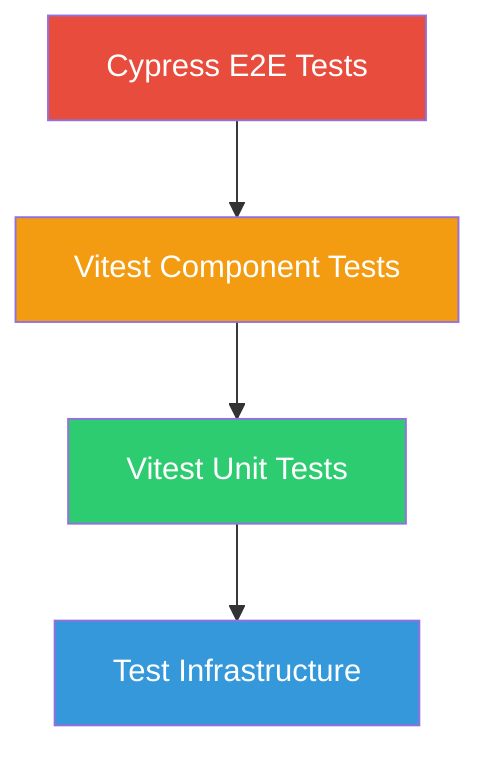

# Test Coverage Plan — Portfolio Next.js

## Overview

This plan defines a comprehensive test suite across three layers:

- **Vitest unit tests** — pure logic, stores, utilities
- **Vitest component tests** — UI components via Testing Library
- **Cypress E2E tests** — full browser flows, i18n, accessibility

---

## Architecture: Test Pyramid



---

## Phase 1: Test Infrastructure

### 1.1 Fix setup file

**File:** [`src/test/setup.ts`](src/test/setup.ts)

- Import `@testing-library/jest-dom` to enable DOM matchers (`toBeInTheDocument`, etc.)
- Add any global mocks needed across tests

### 1.2 Create test utilities

**File:** `src/test/test-utils.tsx` (new)

- Create a custom `render` wrapper that includes:
  - `NextIntlClientProvider` with mock messages
  - Mock for `next/navigation` hooks (`usePathname`, `useRouter`, `useParams`)
  - Theme store provider context
- Export `renderWithProviders`, `mockMessages` (English fixture)

### 1.3 Create i18n mock helpers

**File:** `src/test/mocks/i18n.ts` (new)

- Mock `next-intl` server-side functions (`getTranslations`, `getMessages`)
- Mock `next-intl` client-side hooks (`useTranslations`, `useLocale`)
- Re-export from centralized location

### 1.4 Create Next.js navigation mocks

**File:** `src/test/mocks/navigation.ts` (new)

- Mock `next/navigation` (`usePathname`, `useRouter`, `useParams`, `useSearchParams`)
- Mock `@/i18n/navigation` with same primitives
- Provide configurable mock return values

### 1.5 Create component-specific mocks

**File:** `src/test/mocks/components.ts` (new)

- Mock `next-cloudinary` (`CldImage`)
- Mock `next-turnstile` (`Turnstile`)
- Mock `react-cookie-manager` (`CookieManager`)
- Mock `@vercel/speed-insights` (`SpeedInsights`)
- Mock `gsap` / `@gsap/react` animations
- Mock `motion` (Framer Motion replacement)

---

## Phase 2: Pure Logic Unit Tests

### 2.1 Zustand Theme Store

**File:** `src/stores/__tests__/theme-store.test.ts` (new)

- Initial state: `isDarkStore` defaults to `false`
- `toggleTheme()`: toggles from `false` → `true` → `false`
- `setValue(true)`: sets `isDarkStore` to `true`
- `setValue(false)`: sets `isDarkStore` to `false`
- Multiple rapid toggles maintain correct state
- Store instance is a singleton (Zustand default behavior)

### 2.2 Config Module

**File:** `src/__tests__/config.test.ts` (new)

- `port` defaults to `3000` when `PORT` env is not set
- `port` uses `PORT` env value when set
- `host` returns `localhost:{port}` when `VERCEL_PROJECT_PRODUCTION_URL` is not set
- `host` returns `https://` URL when `VERCEL_PROJECT_PRODUCTION_URL` is set

### 2.3 i18n Routing Config

**File:** `src/i18n/__tests__/routing.test.ts` (new)

- Validates `locales` array contains expected 6 locales
- Validates `defaultLocale` is `"en"`
- Validates all locales have pathname mappings for every route key
- Validates no duplicate pathname values within the same locale
- Validates pathnames are non-empty strings

### 2.4 Middleware Matcher

**File:** `src/__tests__/middleware.test.ts` (new)

- Matcher pattern excludes API routes (`/api/*`)
- Matcher pattern excludes static assets (`/_next/static/*`, `/_next/image/*`)
- Matcher pattern excludes common file types (`.svg`, `.png`, `.webp`, `.gif`, `.txt`)
- Matcher pattern excludes `favicon.ico`, `sitemap.xml`
- Matcher pattern includes locale-prefixed page routes (`/en/about`, `/pt/contact`)

---

## Phase 3: Simple Component Tests

### 3.1 ContactFarewell

**File:** `src/ui/Components/__tests__/ContactFarewell.test.tsx` (new)

- When `submitted=false`: renders with `hidden` CSS class
- When `submitted=true`: renders without `hidden` class, shows title and text
- Translates farewell title and text via `next-intl`

### 3.2 MobileSlideBtn

**File:** `src/ui/Components/Sidenav/__tests__/MobileSlideBtn.test.tsx` (new)

- When `isOpen=false`: shows hamburger icon (`LineMdCloseToMenuAltTransition`), label says "Open menu"
- When `isOpen=true`: shows close icon (`LineMdMenuToCloseAltTransition`), label says "Close menu"
- Clicking the label checkbox toggles `setIsOpen`
- Has `lg:hidden` class (hidden on desktop)
- Translate position matches open/closed state

### 3.3 ThemeToggle

**File:** `src/ui/Components/__tests__/ThemeToggle.test.tsx` (new)

- Checkbox is checked when store `isDarkStore` is `true`
- Checkbox is unchecked when store `isDarkStore` is `false`
- Shows moon-to-sun icon when dark mode, sun-to-moon when light
- `getCookie()` returns `null` in SSR (no document)
- `setCookie()` is no-op in SSR
- `handleChange` updates store and sets cookie
- `useEffect` reads saved cookie on mount
- `useEffect` falls back to `prefers-color-scheme` media query when no cookie

### 3.4 NotFoundPage

**File:** `src/ui/Components/__tests__/NotFoundPage.test.tsx` (new)

- Renders a 404 heading
- Renders a descriptive message
- Renders a link back to home page
- Uses translations from `not-found` namespace

### 3.5 ProfileCard

**File:** `src/ui/Components/__tests__/ProfileCard.test.tsx` (new)

- Renders with image, name, title, and description
- Image has correct alt text
- Accepts and renders custom props

### 3.6 ServiceCard

**File:** `src/ui/Components/Services/__tests__/ServiceCard.test.tsx` (new)

- Renders icon, title, and text
- Icon is an image with correct src and alt

### 3.7 Skeletons

**File:** `src/ui/Components/__tests__/Skeletons.test.tsx` (new)

- Each skeleton variant renders without error
- Skeletons have appropriate aria labels for accessibility
- Skeletons use pulse animation classes

---

## Phase 4: Complex Component Tests

### 4.1 Carousel (Slider)

**File:** `src/ui/Components/__tests__/Carousel.test.tsx` (new)

- Renders the correct number of items from `items` prop
- First item is displayed initially (based on slide order)
- Clicking "next" button advances the slide order
- Clicking "prev" button moves to previous slide
- Wrapping behavior: next on last item → first item appears
- Wrapping behavior: prev on first item → last item appears
- Navigation buttons shown with correct icon images
- Mouse enter pauses auto-play (sets `isPaused=true`)
- Each slide shows title, description, and CTA button
- Slide images have lazy loading attribute

### 4.2 ContactForm

**File:** `src/ui/Components/__tests__/ContactForm.test.tsx` (new)

- Renders all form fields: firstName*, lastName, email*, telephone, message\*
- Required fields are marked with asterisk
- Privacy policy checkbox is required
- Submit button is disabled when Turnstile status ≠ "success"
- Submit button shows loading state text when submitting
- Form is hidden (`hidden` class) when submission state is "submitted"
- ContactFarewell component is rendered on successful submission
- Error message shown when Turnstile fails verification
- Turnstile re-mounts on theme change (animation key increments)
- Form has correct aria attributes (aria-required, aria-autocomplete)

### 4.3 TransitionLink

**File:** `src/ui/Components/Sidenav/__tests__/TransitionLink.test.tsx` (new)

- Renders children inside a `Link` component
- Click handler calls `e.preventDefault()`
- Adds `page-transition` class to `#main` element on click (when navigating to different route)
- Does NOT add transition class when clicking link to current route
- Calls `router.push()` after sleep delay
- Closes mobile sidenav via `setIsOpen` when `isOpen` is true
- Removes `page-transition` class on route change (useEffect)

### 4.4 LocaleSwitcherSelect

**File:** `src/ui/Components/Sidenav/__tests__/LocaleSwitcherSelect.test.tsx` (new)

- Renders a `<select>` with `defaultValue` set
- Renders children as `<option>` elements
- Select is disabled when `isPending` transition is active
- Changing selection calls `router.replace()` with new locale
- Has `aria-label="Select language"`

### 4.5 Sidenav

**File:** `src/ui/Components/Sidenav/__tests__/Sidenav.test.tsx` (new)

- Renders logo heading with translated title
- Renders role subheading
- Renders `NavigationList` with links
- Renders GitHub and LinkedIn social icon links
- Renders `LocaleSwitcher` and `ThemeToggle`
- Renders footer blurb with GitHub link
- Renders `LegalLinks`
- Renders `MobileSlideBtn` (hidden on lg screens)
- On mobile: sidenav slides in/out based on `isOpen` state
- Sidenav has correct aria attributes

### 4.6 NavigationLink

**File:** `src/ui/Components/Sidenav/__tests__/NavigationLink.test.tsx` (new)

- Renders link with translated name
- Link has correct `href` based on locale
- Active link has highlight/underline styling
- Uses `TransitionLink` internally

### 4.7 NavigationList

**File:** `src/ui/Components/Sidenav/__tests__/NavigationList.test.tsx` (new)

- Renders all navigation links from translations
- Each link has correct name and path
- Passes `isOpen`/`setIsOpen` to child `NavigationLink` components

### 4.8 Dock

**File:** `src/ui/Components/Sidenav/__tests__/Dock.test.tsx` (new)

- Renders without crashing
- Contains expected child elements

### 4.9 CustomSelect

**File:** `src/ui/Components/Sidenav/__tests__/CustomSelect.test.tsx` (new)

- Renders with custom styling
- Triggers onChange handler

### 4.10 LegalLinks

**File:** `src/ui/Components/Sidenav/__tests__/LegalLinks.test.tsx` (new)

- Renders privacy policy link
- Renders rights/reserved text
- Links use translated paths

### 4.11 LocaleSwitcher / LocaleSwitcherMobile

**File:** `src/ui/Components/Sidenav/__tests__/LocaleSwitcher.test.tsx` (new)

- Renders LocaleSwitcherSelect with locale options
- Each option has translated label
- Current locale is pre-selected

---

## Phase 5: Provider Tests

### 5.1 CookieBanner (Providers)

**File:** `src/providers/__tests__/CookieBanner.test.tsx` (new)

- Renders children inside `CookieManager` wrapper
- Passes correct translation keys to `CookieManager`
- `consentAnalytics()` updates state and calls `window.gtag()`
- `consentSocial()` updates state
- `consentMarketing()` updates state
- `onAccept` callback grants all three consent types
- `onDecline` callback logs and runs decline logic
- `onManage` callback processes granular preferences
- Privacy policy URL uses translated path
- Display type is set to "modal"

### 5.2 GoogleAnalytics

**File:** `src/providers/__tests__/GoogleAnalytics.test.tsx` (new)

- Injects GA4 script tag with correct measurement ID
- Injects initialization script with consent default "denied"
- Both scripts use `afterInteractive` strategy
- `useEffect` fires `gtag('config', ...)` on route change
- Works correctly when `window.gtag` is undefined (no crash)

---

## Phase 6: Library / Utility Tests

### 6.1 EmailTemplate

**File:** `src/lib/__tests__/EmailTemplate.test.tsx` (new)

- Renders full HTML email structure (Html, Head, Body)
- Renders recipient name in heading
- Renders preview text from translations
- Renders intro paragraphs from translations
- Renders "what happens next" bullet points
- Renders signature with link to daniel-freire.com
- Renders privacy policy link with translated URL
- Uses IBM Plex Sans font family

### 6.2 TurnstileServer (API Route)

**File:** `src/providers/__tests__/TurnstileServer.test.tsx` (new)

- Returns 400 when Turnstile validation fails
- Returns success message when token is valid
- Uses idempotency key to prevent replay
- Uses sandbox mode in development

### 6.3 getData — Date Formatting

**File:** `src/lib/__tests__/getData.test.ts` (new)

- `getCurrentWESTDateTime()` returns formatted string in Portuguese
- Date format matches pattern: `DD de MÊS, YYYY | HH:MM`
- Uses Europe/Lisbon timezone
- (Full server action testing requires Resend API mocking — skip for now)

### 6.4 SVG Exports

**File:** `src/ui/Components/svgs/__tests__/index.test.tsx` (new)

- `index.ts` barrel export includes all SVG components
- Each SVG component renders without errors
- GitHubIcon, LinkedInIcon render with correct viewBox

---

## Phase 7: Page-Level Integration Tests

### 7.1 Home Page

**File:** `src/app/[locale]/__tests__/page.test.tsx` (new)

- Renders `TopMainPage` hero section
- Renders `Techstack` section inside Suspense
- Renders `Cta` call-to-action
- `generateMetadata` returns expected localized metadata
- `setRequestLocale` is called with correct locale

### 7.2 About Page

**File:** `src/app/[locale]/about/__tests__/page.test.tsx` (new)

- Renders `ClientSideAbout` component
- `generateMetadata` returns expected localized metadata with correct canonical URL

### 7.3 Contact Page

**File:** `src/app/[locale]/contact/__tests__/page.test.tsx` (new)

- Renders page title from translations
- Renders `ContactForm` component
- `generateMetadata` returns expected localized metadata

### 7.4 Portfolio Page

**File:** `src/app/[locale]/portfolio/__tests__/page.test.tsx` (new)

- Renders page title with exclamation mark
- Renders `WebsiteCards` component
- Renders `Cta` component
- `generateMetadata` returns expected localized metadata

### 7.5 Error Boundary

**File:** `src/app/[locale]/__tests__/error.test.tsx` (new)

- Renders error title
- Renders error description with rich text (retry button)
- `reset` callback is called when retry button clicked
- `console.error` is called in useEffect

### 7.6 Catch-all / 404

**File:** `src/app/[locale]/[...rest]/__tests__/page.test.tsx` (new)

- CatchAllPage calls `notFound()` (triggers 404)
- GlobalNotFound renders `NotFoundPage` component

### 7.7 Privacy Policy Page

**File:** `src/app/[locale]/(legal)/privacy-policy/__tests__/page.test.tsx` (new)

- Renders privacy policy content
- Page is accessible at correct route

### 7.8 Root Layout

**File:** `src/app/[locale]/__tests__/layout.test.tsx` (new)

- `generateStaticParams` returns params for all 6 locales
- Invalid locale triggers `notFound()`
- Renders `Sidenav`, `Providers`, `GoogleAnalytics`
- Root `metadata` has correct Open Graph image URL
- HTML element has correct `lang` attribute
- Body has correct font CSS variables

---

## Phase 8: Cypress E2E Tests

### 8.1 Content Tests (fill empty file)

**File:** [`cypress/e2e/content.cy.ts`](cypress/e2e/content.cy.ts)

- Home page: hero section, tech stack, CTA button visible
- About page: profile card, paragraphs, images
- Portfolio page: project cards, website cards, CTA
- Contact page: form fields, Turnstile widget, submit button
- 404 page: custom not-found message, link back to home
- Privacy policy page: content renders

### 8.2 Form Tests (expand)

**File:** [`cypress/e2e/forms.cy.ts`](cypress/e2e/forms.cy.ts)

- Form renders all required fields
- Validation: empty submission shows browser validation
- Validation: invalid email format shows error
- Privacy policy checkbox is required
- Successful submission (mock Turnstile)
- Turnstile expiry/error states
- Form hidden after successful submission

### 8.3 Metadata Tests (expand)

**File:** [`cypress/e2e/metadata.cy.ts`](cypress/e2e/metadata.cy.ts)

- Test all 6 locales for correct title
- Test all 6 locales for correct meta description
- Test Portuguese (pt) locale metadata
- Test Danish (dk) locale metadata
- Test Polish (pl) locale metadata
- Test German (de) locale metadata
- Test Czech (cz) locale metadata
- Open Graph tags present on each page

### 8.4 Accessibility Tests (new)

**File:** `cypress/e2e/accessibility.cy.ts` (new)

- Home page passes accessibility scan
- About page passes accessibility scan
- Contact page passes accessibility scan
- Portfolio page passes accessibility scan
- Sidenav navigation has correct ARIA attributes
- Form fields have associated labels
- Skip-to-content link present

### 8.5 Navigation Tests (new)

**File:** `cypress/e2e/navigation.cy.ts` (new)

- Sidenav links navigate to correct pages
- Locale switcher changes language correctly
- Mobile sidenav toggle opens and closes
- Theme toggle switches dark/light mode
- TransitionLink animation class applied on navigation
- Footer legal links navigate correctly

---

## File Structure After Implementation

```
src/
├── __tests__/
│   ├── config.test.ts
│   └── middleware.test.ts
├── i18n/
│   └── __tests__/
│       └── routing.test.ts
├── lib/
│   └── __tests__/
│       ├── EmailTemplate.test.tsx
│       └── getData.test.ts
├── providers/
│   └── __tests__/
│       ├── CookieBanner.test.tsx
│       ├── GoogleAnalytics.test.tsx
│       └── TurnstileServer.test.tsx
├── stores/
│   └── __tests__/
│       └── theme-store.test.ts
├── test/
│   ├── setup.ts                           (updated)
│   ├── test-utils.tsx                     (new)
│   └── mocks/
│       ├── i18n.ts                        (new)
│       ├── navigation.ts                  (new)
│       └── components.ts                  (new)
├── app/[locale]/
│   ├── __tests__/
│   │   ├── page.test.tsx
│   │   ├── error.test.tsx
│   │   └── layout.test.tsx
│   ├── about/__tests__/
│   │   └── page.test.tsx
│   ├── contact/__tests__/
│   │   └── page.test.tsx
│   ├── portfolio/__tests__/
│   │   └── page.test.tsx
│   ├── [...rest]/__tests__/
│   │   ├── page.test.tsx
│   │   └── not-found.test.tsx
│   └── (legal)/privacy-policy/__tests__/
│       └── page.test.tsx
└── ui/Components/
    ├── __tests__/
    │   ├── Carousel.test.tsx
    │   ├── ContactForm.test.tsx
    │   ├── ContactFarewell.test.tsx
    │   ├── NotFoundPage.test.tsx
    │   ├── ProfileCard.test.tsx
    │   ├── Skeletons.test.tsx
    │   └── ThemeToggle.test.tsx
    ├── Services/__tests__/
    │   └── ServiceCard.test.tsx
    ├── Sidenav/__tests__/
    │   ├── CustomSelect.test.tsx
    │   ├── Dock.test.tsx
    │   ├── LegalLinks.test.tsx
    │   ├── LocaleSwitcher.test.tsx
    │   ├── LocaleSwitcherSelect.test.tsx
    │   ├── MobileSlideBtn.test.tsx
    │   ├── NavigationLink.test.tsx
    │   ├── NavigationList.test.tsx
    │   ├── Sidenav.test.tsx
    │   └── TransitionLink.test.tsx
    └── svgs/__tests__/
        └── index.test.tsx

cypress/e2e/
├── accessibility.cy.ts                    (new)
├── content.cy.ts                          (filled in)
├── forms.cy.ts                            (expanded)
├── metadata.cy.ts                         (expanded)
└── navigation.cy.ts                       (new)
```

---

## Implementation Order & Dependencies

```mermaid
graph TD
    subgraph "Phase 1: Foundation"
        A1[setup.ts fix]
        A2[test-utils.tsx]
        A3[mocks/i18n.ts]
        A4[mocks/navigation.ts]
        A5[mocks/components.ts]
    end

    subgraph "Phase 2: Pure Logic"
        B1[theme-store.test.ts]
        B2[config.test.ts]
        B3[routing.test.ts]
        B4[middleware.test.ts]
    end

    subgraph "Phase 3: Simple Components"
        C1[ContactFarewell.test.tsx]
        C2[MobileSlideBtn.test.tsx]
        C3[ThemeToggle.test.tsx]
        C4[NotFoundPage.test.tsx]
        C5[ProfileCard.test.tsx]
        C6[ServiceCard.test.tsx]
        C7[Skeletons.test.tsx]
    end

    subgraph "Phase 4: Complex Components"
        D1[Carousel.test.tsx]
        D2[ContactForm.test.tsx]
        D3[TransitionLink.test.tsx]
        D4[LocaleSwitcherSelect.test.tsx]
        D5[Sidenav.test.tsx]
        D6[NavigationLink.test.tsx]
        D7[NavigationList.test.tsx]
        D8[other Sidenav components]
    end

    subgraph "Phase 5: Providers"
        E1[CookieBanner.test.tsx]
        E2[GoogleAnalytics.test.tsx]
    end

    subgraph "Phase 6: Library"
        F1[EmailTemplate.test.tsx]
        F2[TurnstileServer.test.tsx]
        F3[getData.test.ts]
        F4[svgs/index.test.tsx]
    end

    subgraph "Phase 7: Pages"
        G1[Home page.test.tsx]
        G2[About page.test.tsx]
        G3[Contact page.test.tsx]
        G4[Portfolio page.test.tsx]
        G5[Error.test.tsx]
        G6[Catch-all tests]
        G7[Privacy policy test]
        G8[Layout.test.tsx]
    end

    subgraph "Phase 8: Cypress E2E"
        H1[content.cy.ts - filled]
        H2[forms.cy.ts - expanded]
        H3[metadata.cy.ts - expanded]
        H4[accessibility.cy.ts - new]
        H5[navigation.cy.ts - new]
    end

    A1 --> A2
    A2 --> A3
    A2 --> A4
    A2 --> A5

    A1 --> B1
    A2 --> C1
    A2 --> D1

    B1 --> C3
    A2 --> E1
    A2 --> F1
    A2 --> G1

    D5 --> G1
    E1 --> G1
```



---

## Key Considerations

### Mock Strategy

- **Server Components & Server Actions:** Complex async functions with API calls (like `getData`, `resend`) should be mocked at the module level using `vi.mock()`.
- **next-intl:** Both server-side (`getTranslations`, `getMessages`) and client-side (`useTranslations`, `useLocale`) need mocking. The server mocks differ from client mocks.
- **next/navigation vs @/i18n/navigation:** The project uses `@/i18n/navigation` (which wraps `next-intl/navigation`), so mocks must cover both paths.
- **Third-party widgets:** Turnstile, CookieManager, CldImage — all need simple stub mocks that render nothing.

### Known Issues in Source Code

- [`TransitionLink.tsx`](src/ui/Components/Sidenav/TransitionLink.tsx:6-7) imports from `node_modules/cypress/types/lodash` and `path` — these look like erroneous auto-imports and should be cleaned up before testing.
- [`Services/Services.tsx`](src/ui/Components/Services/Services.tsx:1) is entirely commented out — no tests needed.
- [`posthog.tsx`](src/providers/posthog.tsx:1) is entirely commented out — no tests needed.

### Running Tests

```bash
pnpm test              # Run all Vitest tests
pnpm test:coverage     # Run with coverage report
pnpm test:watch        # Watch mode
pnpm cypress open      # Open Cypress test runner
```
